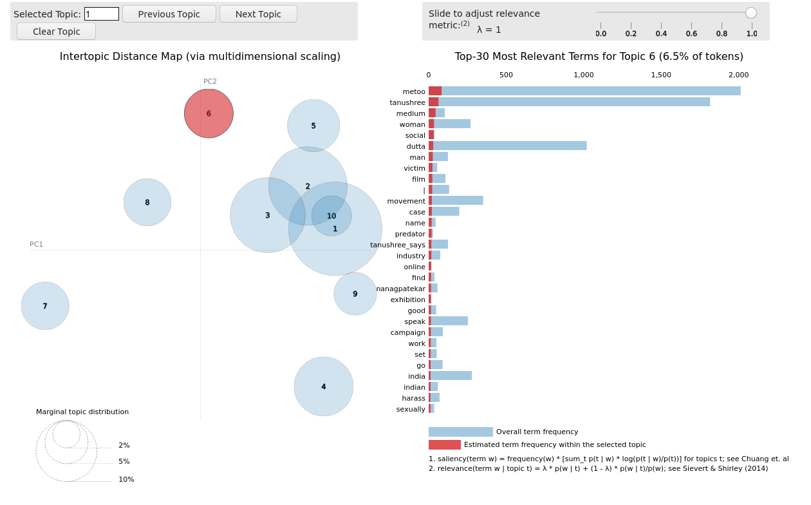

# Topic-Modelling

Topic Modelling and Trends across keywords during MeToo movement in India
We do analysis of the tweets trending with #MeToo movement and try to understand what sort of topics were being discussed.

## Installation
With the environment file given, simply do
`conda env create -f environment.yml`

## Usage
### Tweets URL
Firstly we use snscrape to get the tweets we want. The basic usage is as follows - 
`snscrape  twitter-search "#metoo aib  since:2018-10-26 until:2018-11-26 lang:en " > tweets_url.csv`
You can use this to scrape instagram as well. More about it [here](https://github.com/JustAnotherArchivist/snscrape)  

### Scrape Tweets
We use tweepy library to scrape the tweets. This will return the tweets and other info. 
`python extract.py tweets_url.csv tweets.csv`

### Analysis
We do [Topic Modelling using LDA](https://towardsdatascience.com/topic-modeling-and-latent-dirichlet-allocation-in-python-9bf156893c24) to understand the topics in a more coherent fashion. This is an unsupervised technique to understand the context of the tweets and accordingly build on it. We use this method to understand the public sentiment and reactions during the phase of #Metoo